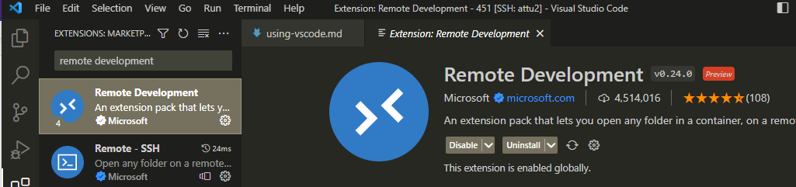
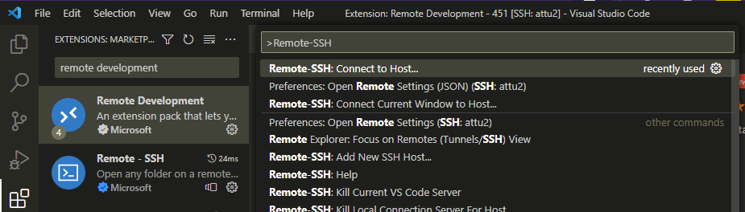
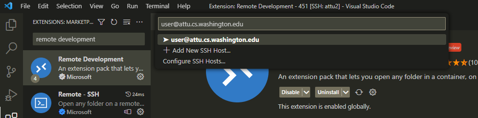
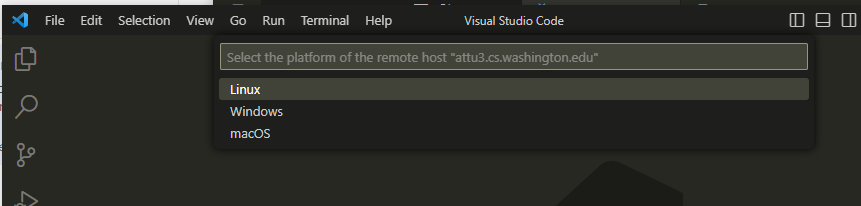
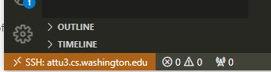
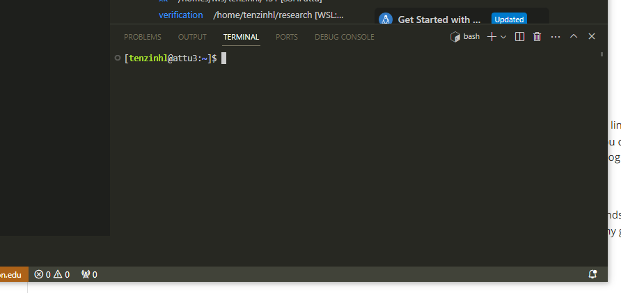

# Using VSCode for CSE 451

<!-- Originally by: tenzinhl -->

Hey there! I'm Tenzin (tenzinhl), a current/former (depending on when you're reading this) CSE 451 TA.

In section + in-person I've seen people ponder the perennial question that comes about with every new course: "What tools do I use for development?"

To be clear: pretty much any text editor will do for this class. While you'll be running your OS + tests on attu, the actual editing of source files could theoretically be done anywhere (and then the changes just pushed + pulled onto attu).

That being said, ideally you'll want to be using something which directly edits the files on attu (rather than constantly having to pull the changes onto it, since that'd be a hassle), since a super important iteration cycle is `edit -> test -> edit`..., and having to push + pull after each edit would slow that down significantly.

What tools will you need? Well the main choice to make is what text editor/IDE you want to use.

The main options (as far as I've seen):

- VSCode
- Vim

This post will be about how to use VSCode for developing attu. In general there should be a wealth of info online about how to do the setup I'm going to try and guide you through since VSCode is one of the most popular text editor/IDEs around these days, so if you need extra resources definitely give good ol' Google a shot.

# Setting Up VSCode Remote Development

1. The first step to using VSCode is downloading it. https://code.visualstudio.com/download. Download it for your machine. And open it.
2. Go to the extensions tab (on the left sidebar)
3. Look up the "Remote Development" package and install it (in reality we really only need the "Remote - SSH" extension, but whatever, they're all pretty lightweight and great if you ever need them).
    
4. This extension adds software that lets VSCode talk with a remote VSCode server over an SSH tunnel and communicate editing information with it, such that your local VSCode instance acts as if you had opened it on the remote server! This extension is beautiful and there's many other classes where it'll allow for easier development. Getting familiar with it and with how to use it will serve you well.
5. Open the command palette with ctrl + shift + p
6. Type in "Remote-SSH: Connect to Host" (or some fragment thereof, the command palette searches commands fuzzily)
    

7. Select the "Remote-SSH: Connect to Host..." option. It will prompt you for what SSH host to connect to (it pulls this list from your `~/.ssh/config`, so if you've already configured attu as a host you can just connect there, otherwise follow step 7)
8. Type in `<username>@attu.cs.washington.edu` to ssh into attu. (I'm assuming you've setup ssh keys for accessing attu before this, if not feel free to open a public thread)
    
9. VSCode will ask what platform the host your connecting to (attu) is on. The answer is Linux. 
    
> Why does VSCode ask this? It's because under the hood it needs to install a VSCode server application on attu that communicates with your local VSCode editor (allowing you to do all of the remote development sugary stuff)
10. It'll do a bit of downloading, but then you should be connected! At this point VSCode is in remote mode as indicated by the Orange strip at the bottom left of the window
    
11. Now all you need to do is open the folder you're looking to develop in (your xk folder) in VSCode! You can do this either by going to "File > Open Folder" or going to the file browser (one of the left-hand tabs) and clicking "Open Folder". In either case navigate to the path of your xk folder and open it!

You should now be setup for doing remote xk development on Attu using VSCode!

There's additional tips/tricks for VSCode below. I'd **highly recommend** [setting up C/C++ intellisense (see below)](#cc-intellisense).

# General VSCode Tips + Tricks

## The Command Palette

The command palette is used to run VSCode commands. All commands available through the UI + even more are available through the command palette (extensions also dump extra commands here). Use `ctrl + shift + p` to open the command palette. When this guide says to "run {insert VSCode command}", that means you should look it up and run it from the command palette.

This lets you search all commands available (as long as they've been registered by the appropriate extension etc.). One main command I use is "Reload window" (this does a soft restart of VSCode when stuff is buggy/requires a restart). You'll also need to use it whenever you need to access Remote development commands. (e.g.: "Remote-SSH: Connect to Host").

## Quick Opener

`ctrl+p`. Opens the quick opener. Uses fuzzy search to search for files. If you remember there's a file called "blah blah blah memory blah blah" but can't remember the full path and finding the path would be a pain, use the quick opener! (Just type "memory" in there and you should find the file).

As an aside: more generally when you're looking for a file but you only remember a fragment of it's name (say "frag"), use find `dir/ | grep` frag to search recursively through all files in `dir/` for any paths containing "frag".

## The Integrated Terminal

Great you can edit text, but what about the test part of the `edit -> test -> edit`... cycle? Well you'll want to use a terminal to run all of your fancy dancy make commands. VSCode has you covered. When you've opened a remote folder the integrated terminal automatically opens in an ssh session connected to the remote host you're on!

(you can tell when VSCode is in remote mode as it will have an orange bar on the bottom left indicating what host you're SSH'ed into, in this image that's attu2)

Use ``ctrl + ` `` to open the integrated terminal. Now you have a console you can use freely, let your linux wizardry commence. (Note the VSCode integrated terminal also has pretty solid tiling support, so you can open two terminals side by side, or multiple in different tabs etc., play around to find out how or Google to see how).

> ^The integrated terminal. Note that it's open on attu3!

Personally I will say when debugging though that I found it preferable to use a separate terminal window(s) (I use "Windows Terminal") when doing heavy GDB stuff. However for quick git commands and when you just want to run tests while making iterative code changes, integrated terminal was my go-to.

## C/C++ Intellisense

The VSCode extension marketplace has a C/C++ extension that adds intellisense (so autocompletion, type checking, linting, "Go to definition" functionality) that really speeds up development. "Jump to definition" and autocomplete have saved me dozens of hours of time.

To install: just go to the extensions tab and look up "C/C++". The extension is by Microsoft. Install it.

For the most part this should just work, however here's some tips to make the experience better:
- VSCode opens in a directory. Open the repo directory (File > Open Folder). This spares the parser from having to parse too many unnecessary files, and improves git integration for similar reasons.
- **Configure your C/C++ properties**. Open the command palette and select "C/C++: Edit Configurations (JSON)". Replace the contents of the file it opens with the contents of [`sample_c_cpp_properties.json`](./sample_c_cpp_properties.json)

After this it should just work (may require a VSCode restart). Because it's typically a little finicky and not the focus of the course however, the course staff can't promise to help everyone debug C/C++ VSCode intellisense issues (but the documentation out there is very solid and should help you figure out your issues if need be).

## Code Formatting

If you've installed the "C/C++" extension then it also comes with a local clang-format installation! Use `shift + alt + f` when you have a file open (or the "Format file" command in command palette) to format the current file! You may want to mess around with the `C_Cpp.clang_format_fallbackStyle` setting in VSCode to get it to default to the style you're looking for.

But this is great for when you don't want to have to worry about alignment all the time, and instead occasionally just run `shift + alt + f` to get everything wrapped nicely.

## Full-text Search ("Search in all Files")

This is less relevant if you have intellisense and it's working well, but if it isn't, sometimes you're left wondering "what the hecc is this type that they're using??". Without search you'd just manually be jumping around files to try and find the definition. With search let the computer do the manual jumping for you!

Not a VSCode-specific functionality, but if you weren't aware of it or had avoided using it (I used to avoid it since I was worried it'd be slow), lemme tell you know: USE THE SEARCH. I've used this in industry on mega mono-repo's with bajillions of generated files and a garbage web of symlinks, and it still worked. IDK how they did it, but VSCode has built a behemoth search function. It's fast.

Use `ctrl + shift + f` to open the "search in all files" sidebar tab. Enter your text (there's options for enabling case sensitivity, using regex, and searching only whole "words" (delimited by whitespace and certain special characters)).
