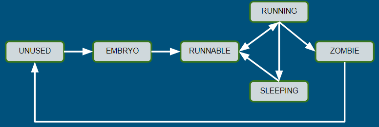

# Processes in `xk`

<!-- Originally by: tenzinhl -->

An introduction to how processes are tracked and used within the starter code provided to students.

## What is a Process

As a quick review, in general OS terms a *"process"* is:
- **An OS abstraction**: processes are an abstraction that are managed by the
  OS. The OS abstracts the work of context switching and page table management
  from clients of the OS.
- **Unit of execution**: a single process is an instance of a program (where a
  "program" is a binary file on disk). The value of processes is that we can run
  multiple concurrently, allowing our OS to *effectively* run multiple programs
  at once. "*Effectively*" only because we run `xk` with a single CPU, and we
  just context switch between processes quickly.
- **An isolation guarantee**: processes are isolated from each other. In `xk`,
  the only way one process should be able to impact another after both have
  started is through pipes (lab 2 part 2) and `kill`. In most production
  operating systems, "isolation" is a much more complex property with varying
  definitions (as well as an active area of research).

## How Processes Are Implemented in `xk`

### Datastructures

In `xk` we track the state for a single process using `struct proc` in `proc.h`.
Some `struct proc` fields worth highlighting:
- `struct vspace vspace`: we need a `vspace` per process, since each process has
  its own virtual address space.
- `char* kstack`: each process needs its own kernel stack `kstack`, which is
  used as the stack when we enter kernel mode due to interrupts.
- `enum procstate state`: the `state` of a process tells us where in **the
  process lifecycle** a process is (which determines whether a process will be
  scheduled). We'll talk about this more below.

Then to track multiple processes, we maintain `ptable`: a global array of `struct proc`'s defined in `proc.c`. Similar to the global file table you implement in lab 1 (assuming you implement a global file table following `lab1design.md`), the global array just provides a way of statically pre-allocating space to use for processes when we need them.

> Aside: a `struct proc` is sometimes also referred to as a "process descriptor" or a "Process Control Block" (PCB).

### The Process Lifecycle

All `struct proc`'s exist in some state in the process life cycle at any given moment in time. Where a `proc` is in the process lifecycle tells us information about its resources and whether or not it should be scheduled or cleaned up.

`UNUSED`:

When the `xk` ELF is loaded by the bootloader (`bootmain.c`), the `ptable` is 0-initialized like all global variables. This means all `struct proc`'s in `ptable` start off with `state == UNUSED`. `UNUSED` means that the `struct proc` is free to be used by any new processes.

`EMBRYO`:

Process slots in the `ptable` should be allocated using `allocproc`. `allocproc` finds the first `UNUSED` proc in the `ptable` and allocates some resources for the proc. Once done the newly allocated `struct proc` is marked with `state == EMBRYO`.

`RUNNABLE`:

A process will remain in the `EMBRYO` state until its state is set to `RUNNABLE` (which needs to be done manually in code). `RUNNABLE` marks a process as ready to run (and thus eventually when the scheduler gets around to it the process will be scheduled). It is **the only state from which processes will be scheduled to run**.

For more details on how processes are scheduled, see [context_switching.md](../context_switching.md) and [scheduler.md](../scheduler.md).

`RUNNING`:

When a `RUNNABLE` process is scheduled, its state is set to `RUNNING` for the duration of while its scheduled.

`SLEEPING`:

A process enters the `SLEEPING` state when `sleep` (in `proc.c`) is called by a process. A `SLEEPING` process will transition back to the `RUNNABLE` state when `wakeup` is called using the same `chan` argument as the process used to call `sleep` (`chan` is an arbitrary `void*` value to allow any value to be used as the "channel" to sleep on). Or alternatively a `SLEEPING` process can be manually woken by just setting `state` to some other state (e.g.: `kill` in `proc.c` manually wakes up the killed process so that it can exit once it is scheduled).

`ZOMBIE`:

A process enters the `ZOMBIE` state once it has exited by calling `exit`. This indicates the process is finished, however still has some resources that need to be reclaimed. Once those resources are reclaimed, the process should return to the `UNUSED` state.
